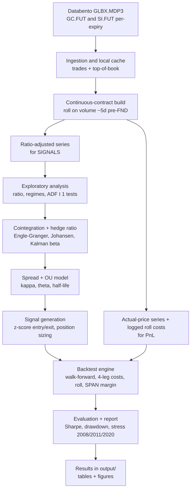
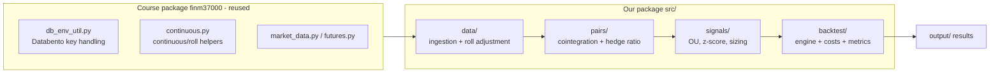

# Project Design: Gold/Silver Futures Pairs Trading

> Design and component overview for the FINM 37000 project. Companion to the README: the README states *what* we deliver and how to run it; this document shows *how the pieces fit together* and *why*. Maintained as part of the Design-leader work; the task breakdown lives in the repo Issues.

## 1. Goal in one line

Build a reproducible pipeline that pulls CME Gold (GC) and Silver (SI) futures from Databento, constructs a statistically valid spread, generates mean-reversion signals, and backtests the strategy with realistic futures costs, then reports honestly whether an edge survives.

## 2. Pipeline (data to result)

## 3. Components

We reuse the professor's `finm37000` package for the data and roll plumbing rather than rebuilding it; our package holds the pairs-trading logic on top.

## 4. Key design decisions

| Decision | Choice | Why |
|---|---|---|
| Pair | Gold (GC) vs Silver (SI) | Economically linked precious metals; course-permitted (energy mean-reversion is not) |
| Selection method | Cointegration backbone, distance as benchmark | A single known pair needs no ML search; cointegration gives a tradable spread |
| Hedge ratio | Rolling / Kalman, not static OLS | The GC/SI relationship drifts and breaks in some regimes; a static beta is unsafe |
| Signal | OU half-life + z-score bands | Standard, interpretable; half-life estimated on our data, not borrowed from papers |
| Continuous series | Two series: ratio-adjusted (signals) + real-price (PnL) | Databento continuous prices are unadjusted; mixing adjustment methods corrupts either the signal or the PnL |
| Costs | 4-leg bid-ask + monthly roll + SPAN margin | A spread crosses the spread on both legs each entry and exit; ignoring this inflates returns |
| Libraries | statsmodels, scipy, pykalman (all free) | No dependency on paid tooling (ArbitrageLab is paid; excluded) |
| Advanced model | Copula optional; skip PCA and ML selection | Copula is genuinely bivariate; PCA/ML add complexity without payoff for one pair |

## 5. How the Issues map to components

| Issue | Component | Produces |
|---|---|---|
| Structure + env | repo root | installable environment |
| Databento ingestion | `data/` | cached GC/SI frames |
| Continuous + roll | `data/` | ratio-adjusted + real-price series |
| EDA | notebook | tradability assessment |
| Cointegration + hedge ratio | `pairs/` | spread definition |
| OU + half-life | `signals/` | reversion parameters |
| Signal generation | `signals/` | dated positions |
| Backtest | `backtest/` | equity curve with costs |
| Evaluation | `backtest/` + `output/` | metrics + figures |
| Copula (stretch) | `signals/` | benchmark comparison |

## 6. Central risk (state it up front)

The gold/silver long-run relationship is **not stable**. The empirical literature finds cointegration in some periods and breakdown in others (notably the 1990s, and blow-outs in 2011 and March 2020). We therefore treat "the pair is cointegrated" as a hypothesis to test across sub-periods, use strictly out-of-sample calibration, and report whether the edge survives transaction costs rather than assuming it does. A clear negative result, honestly shown, is a valid and strong outcome for this project.
